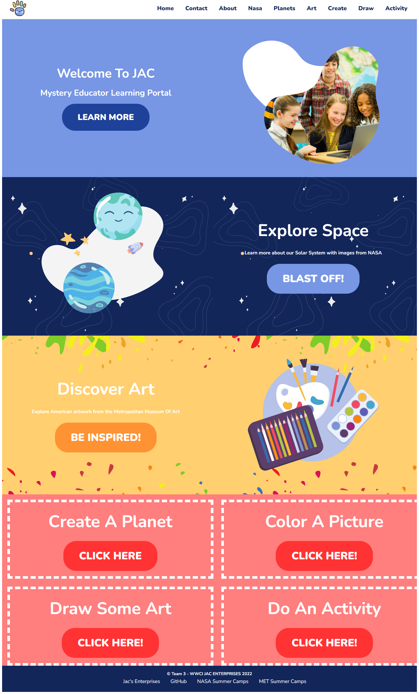

# JAC Mystery Educator

## Table Of Contents

- <a href="#lang">Technologies</a>
- <a href="#about">About</a>
- <a href="#demo">Demo</a>
- <a href="#notes">Notes</a>
- <a href="#resources">Resources</a>
- <a href="#contact">Contact</a>

## Installation

### Server Side (Back end)
This is a Spring Rest Data JPA environment which will run at `localhost:8080`

### Client Side (Front end)

This is a single page JavaScript application built using React which will run at `localhost:3000`.

## How to run this app

- clone the application locally onto your machine
- Using IntelliJ, navigate into `application` and open the Spring project, run the application file.
- `cd` into `react-client`, open with VS Code and run `npm install` to install all frontend dependencies
- Run the front end with `npm start`

## Technologies

- Java
- Spring JPA
- Javascript
- Node
- React JS
- JSX / SCSS
- Rest API

<!-- About -->

## About

JAC Mystery Educator is an educational and interactive application for school age children teaching them in areas of science, art, and history.

(<a href="#top">BACK TO TOP</a>)

## Demo & Screenshots

## Notes

Our goal for this project is to educate children with an easy to use and interactive application that exposes them to unique aspects of science, art, and history. With our application, parents and educators have the ability to offer their students a safe and fun way to learn online.

(<a href="#top">BACK TO TOP</a>)

## Resources Used

- Canva
- Freepik
- Flaticon
- React Sketch Canvas

## Contact & Contributors

LinkedIn:
 <a href="https://www.linkedin.com/in/penny-schuenke//">Penny Schuenke</a>
 <a href="https://www.linkedin.com/in/chad-zimmerman-4b4b35220/">Chad Zimmerman</a>
 <a href="https://www.linkedin.com/in/hakan-celik-84818347/">Hakan Celik</a>
 <a href="https://www.linkedin.com/in/zibad/">Zibad Maldaye</a>
 <a href="https://www.linkedin.com/in/noellegisewhite/">Noelle Gisewhite</a>

(<a href="#top">BACK TO TOP</a>)

